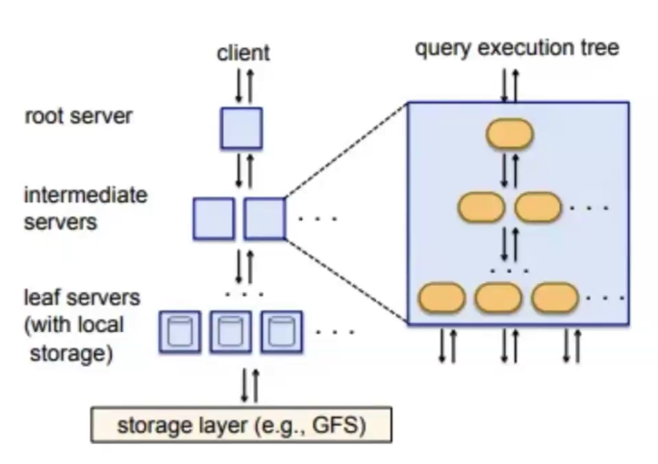

# Dremel
## What is Dremel?
+ **Scalable, interactive ad-hoc query system** designed for analyzing read only nested data
+ A distributed system developed at Google for interactively querying large datasets in place
+ In production since 2006 and has thousands of users within Google Provides a 
+ high-level, SQL-like language to express queries

## Why was it created?
+ Low cost storage enabled collection of large scale business critical data
+ Important for analysts and engineers to generate meaning out of this data interactively
+ Interactive response times often make a qualitative difference in data exploration, monitoring, online customer support, rapid prototyping, debugging of data pipelines, and other tasks.
+ Traditional relational databases were not suitable for massive datasets, had scalability and performance issues
+ MapReduce is not suitable for interactive analysis.
+ It operates in batch mode, which means all data has to be processed before results are available for it.
+ Requires running a bunch of jobs which take a lot of time relative to Dremel which takes a fraction of the time.
+ MR operates in batch mode so queries can't be built iteratively.

## Key Features
A distributed system for interactively querying large datasets in-place

+ Distributed: System scales to thousands of CPUs and petabytes of data, and has thousands of users at Google.
+ Interactive: Allows users to write, refine, and iterate on queries quickly.
+ Large: Web-scale datasets
+ In-situ processing

## Architecture
Columnar Storage

Root:
Read metadata

Intermediate:
+ query optimization, rewrites query (i.e. include shards) 
+ Partial aggregation, filtering

Leaf:
+ Read data
+ Perform filters and final aggregation
Execution threads (slots)

